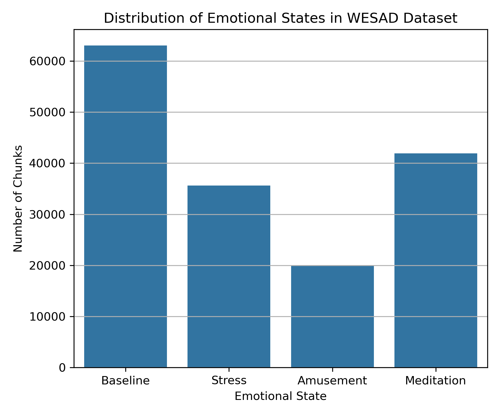
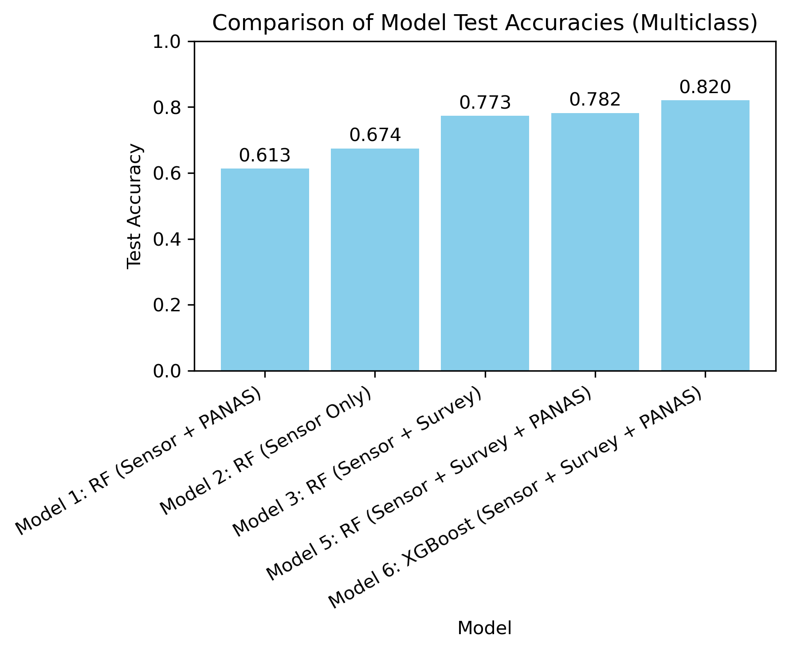
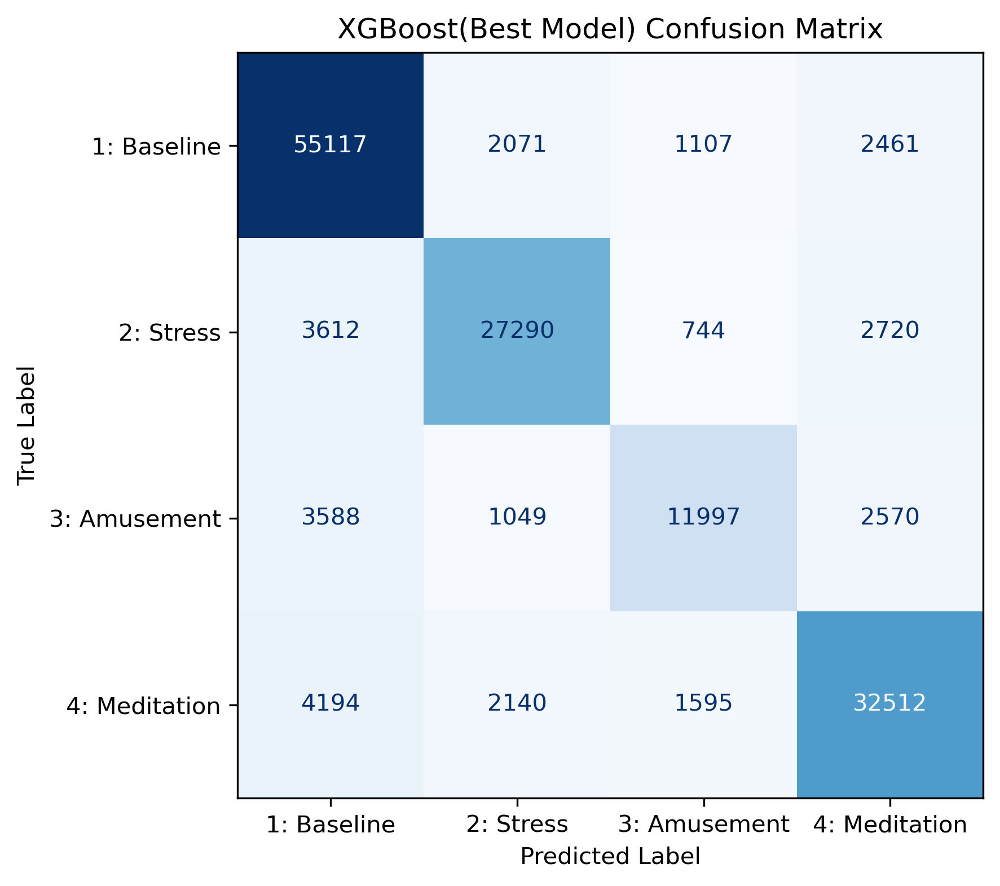
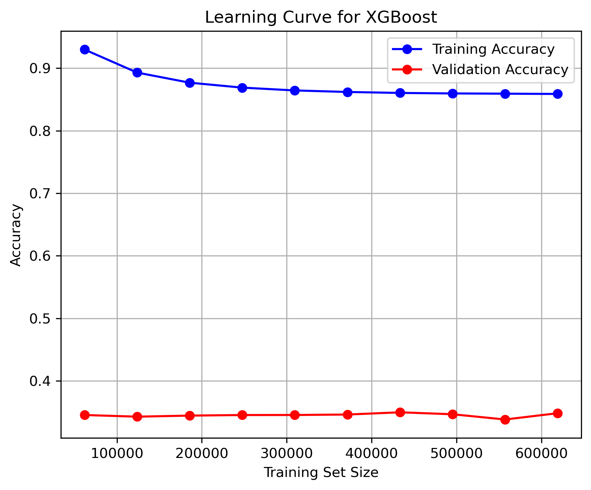
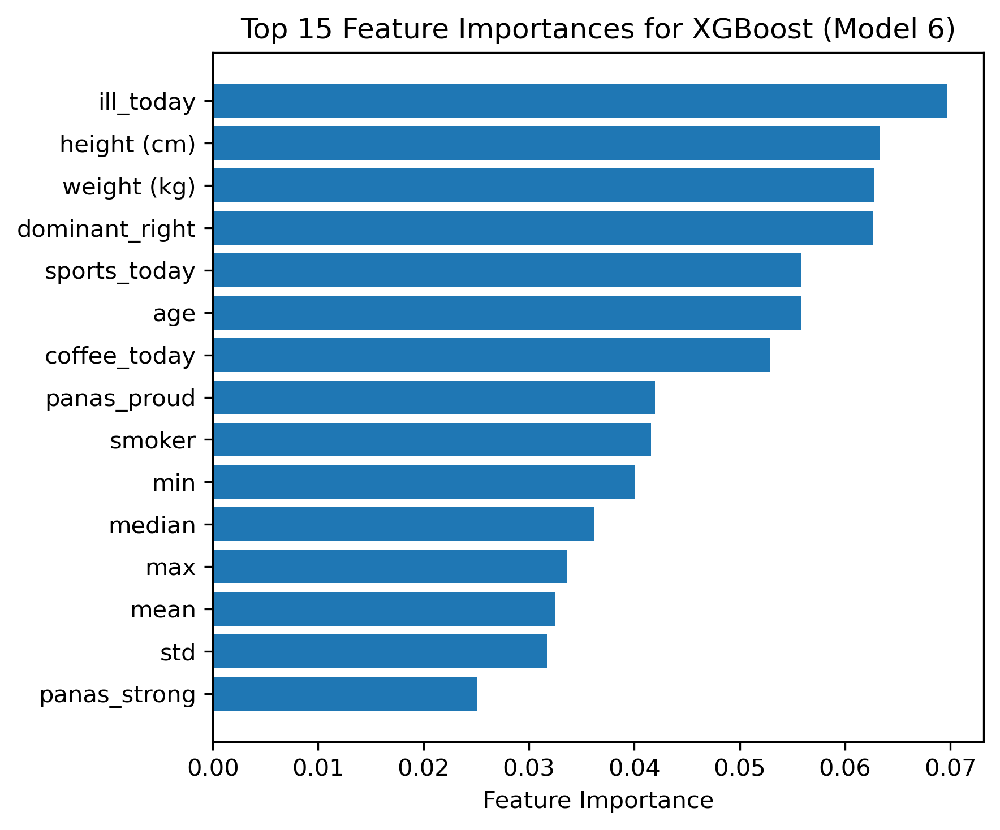
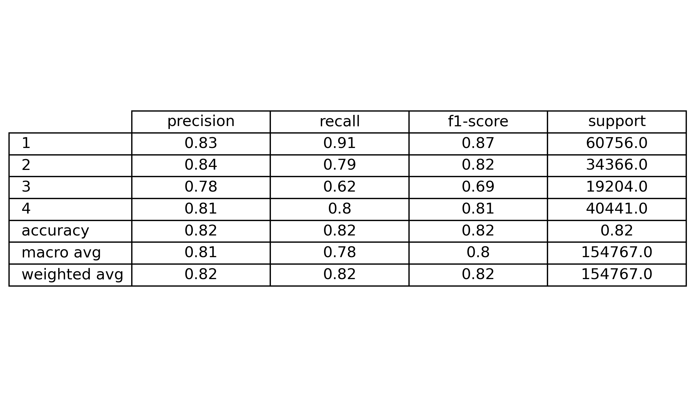

# DSC232R_WESAD_Project
WESAD Wearable Stress and Affect Detection Analysis Project for DSC 232R
https://ubi29.informatik.uni-siegen.de/usi/data_wesad.html 

## <u>Introduction </u>

We chose the Wearable Stress and Affect Detection (WESAD) dataset because of our mutual interest in utilizing a unique dataset that has real-world applications outside of this course. WESAD offers real-world physiological time-series data in conjunction with robust self-report data.

The dataset is collected from a controlled lab study that focuses on classifying participants’ emotional states. The states include a neutral baseline, stress, amusement and meditative state based on physiological and motion sensor data. What makes this dataset particularly compelling is its combination of physiological and behavioral signals, allowing us to explore complex patterns in human affect.
Building accurate predictive models in this domain could have significant implications for mental health monitoring, early stress detection, and personalized health interventions. In an era where mental well-being is increasingly prioritized, developing models that can detect stress or emotional shifts in real time using wearable devices could transform how individuals and clinicians approach psychological health.
By working with this dataset, we also gain interdisciplinary insights at the intersection of machine learning, psychology, and health technology, equipping us with a more holistic view of how data science can contribute to human well-being. This would also allow the team to widen their knowledge on psychological research paradigms that pair physiological information to emotional states as a hard metric to help inform mental health care.
The following sensor modalities are included (worn either via chest or wrist): blood volume pulse, electrocardiogram, electrodermal activity, electromyogram, respiration, body temperature, and acceleration. With these sensors we are able to explore the important features and trends between the classifications of: baseline vs. stress vs. amusement vs. meditation.

### Figures 


**Figure 1.** Distribution of labeled emotional states in the processed WESAD dataset. Each count corresponds to a 1,000-sample signal chunk, highlighting a moderate class imbalance with fewer examples of Amusement and Stress compared to Baseline.


**Figure 2.** Test Accuracy of Each Multiclass Classification Model


**Figure 3.** Confusion Matrix Model 6


**Figure 4.** Learning Curve for XGBoost Classifier Showing Training and Validation Accuracy


**Figure 5.** Top 15 Feature Importances for XGBoost (Model 6).


[Image](https://github.com/user-attachments/assets/cedb2201-1f92-4bcd-8aa8-dc6cbe107886)
**Figure 2.** Learning Curve Model 2


**Figure 3.** Confusion Matrix Model 2


## <u>Methods </u>

### Environment Set-Up
<br>To set-up our SDSC Jupyter Job and environment we used the following configurations and steps:</br>

**Compute Resources:**

We requested the following in our job submission:

Number of cores: 50

Memory per node: 25 GB

Working Directory: Home Directory

We used the following singularity image provided by professor for each job session for our singularity container: ~/esolares/spark_py_latest_jupyter_dsc232r.sif

Environment modules to be loaded: 'singularitypro'

Working directory: 'home'

Type: 'jupyterLab'

### Data Retrieval

1) To retrieve the WESAD data we retrieved a zipped version of the file found here:
<br> <u>https://uni-siegen.sciebo.de/s/HGdUkoNlW1Ub0Gx/download </u></br>

2) We used the following command and put it in our home directory
<br> ` wget https://uni-siegen.sciebo.de/s/HGdUkoNlW1Ub0Gx/download . ` </br>

3) Once retrieving we unzipped the data as it comes in a zipped format
<br> ` unzip download ` </br>

### Data Exploration

The majority of our data is formatted as time series data with synchronization points captured by wearable chest and wrist sensors. The sensors were worn while participants were asked to do tasks to induce stress, amusement, meditation and a baseline was collected. For preprocessing we consolidated self-report questionnaires into one dataframe and assessed sensor data separately by subject. Additionally, we removed some of the labels we did not need identified by the data structure to be undefined or unnecessary for processing. 

We visualized participant S2s data to gain an understanding of the distribution for the chest and wrist sensor data associated with the study. We evaluated the data to understand the structure of the files, the sensor descriptions and the number of observations and null values. Because of the nature of collection using body worn sensors, there is no missingness in sensor data. 
As part of our model building we intend to explore the connection between the self report surveys and the sensor data. See below in ‘results’ for a higher level view of data.


### Preprocessing

- **Signal Aggregation and Chunking:** We grouped .pkl data by modality (e.g., ECG, EMG, EDA, TEMP) and exported them as CSVs. Each signal was segmented into chunks of 1,000 consecutive readings. For every chunk, we computed summary statistics: mean, std, min, max, mode, median. These transformed time-series data into tabular features.

- **Feature Consolidation:** Each subject’s processed signal chunks were combined into a unified DataFrame named final_df. Each row corresponded to a chunk.

- **Label Filtering:** Labels outside the main study conditions (i.e., 0, 5, 6, 7) were excluded. Only chunks labeled with 1 (Baseline), 2 (Stress), 3 (Amusement), or 4 (Meditation) were retained.
- **Train-Test Splitting:** To preserve subject-level independence, we used GroupShuffleSplit with subject IDs as groups for model 1. The data was split into training, validation, and test sets.

- **Survey Date Extraction:** In parallel, survey data for each subject was extracted from individual ‘_readme.txt’ files located in their respective folders. Key variables (age, height, weight, gender, handedness, coffee consumption, sports, smoking, and illness status) were parsed, encoded as binary or numeric features, and aggregated into a unified table (‘wesad_survey.csv’), excluding subjects S1 and S12. This survey table was then merged with the processed chunk-level feature table (‘final_df’) using the subject identifier, resulting in ‘wesad_merged_df.csv’, which contained both physiological and survey features for each chunk. 

### Model 1: Random Forest Classifier (Sensor Data + PANAS)

- Used both sensor and PANAS questionnaire features.
- Parameters:
```
    rf = RandomForestClassifier(
    n_estimators=75,
    random_state=45,
    class_weight='balanced',
    max_depth=10,
    min_samples_leaf=5)
 ```
</br>
- Merged PANAS with `final_df`, dropped columns with high missingness, train/validation/test split via GroupShuffleSplit.
<br></br>

### Model 2: Random Forest Classifier (Sensor Data Only)
<br>Model 2 uses a Random Forest Classifier from the sklearn.ensemble module, which is appropriate for handling high dimensionality and noisy datasets. The goal of this model is to predict the label 1, 2, 3 or 4 of each sample and output a predicted class for each sample, allowing us to identify patterns in the features and distinguish the strongest feature statistic that predicts a label.  </br>

- Excluded questionnaire data, used only sensor features.
- Parameters:
```
rf = RandomForestClassifier(
    n_estimators=100,
    random_state=45,
    class_weight='balanced',
    max_depth=20,
    min_samples_leaf=3)
``` 

<br>n_estimators = 100: The model builds 100 decision trees.</br>
<br>random_state = 45: Ensures reproducibility.</br>
<br>class_weight = 'balanced': Automatically adjusts weights inversely proportional to class frequencies.</br>
<br>max_depth = 20: Limits the depth of each decision tree to control overfitting.</br>
<br>min_samples_leaf = 3: Setting the minimum number of samples required to be at a leaf node, helping reduce variance</br>
The model was trained using the training set and evaluated on both the validation and test set, we used 70% training , 20 % for test and 10% validation. 

The merged dataset (‘wesad_merged_df.csv’) was used as input for the Random Forest model. Prior to training, features with zero importance (identified previously in an importance ranking) were removed. The final feature set included both physiological summary statistics and survey variables for each data chunk. 


### Model 3: Random Forest Classifier (Sensor Data + Survey Data)
<br>To select the optimal hyperparameters for the Random Forest model, several values for `n_estimators`, `max_depth`, and `min_samples_leaf` were systematically evaluated. Each combination was assessed based on training and test accuracy, and the values that balanced high test accuracy with reduced overfitting were chosen (see Results section/Model 3, Figure 2).</br>

A Random Forest classifier was trained with the following hyperparameters:
<br>`n_estimators=100` (number of trees in forest)</br>
<br>`max_depth=23` (maximum depth of each tree; set to prevent overfitting)</br>
<br>`min_samples_leaf=2`’ (minimum samples required at a leaf node; helps reduce overfitting)</br>
<br>`random_state=42` (ensures reproducibility)</br>

```
rf = RandomForestClassifier(
    n_estimators=100,
    max_depth=23,           
    min_samples_leaf=2,    
    random_state=42 
)

rf.fit(X_train, y_train)
```

### Model 4: Random Forest Classifier(Sensor Data + Survey Data, Binary)
<br>For binary stress classification, a new target variable `stress_binary` was created, where label 2 (stress) was mapped to 1 and all the other labels to 0. Features with zero importance (e.g., `coffee_last_hour`, `smoked_last_hour`) and columns unrelated to prediction were dropped. The data was split using an 80/20 stratified split to preserve class balance. </br>

A Random Forest classifier was trained with:
`n_estimators=100` (number of trees, chosen for good performance and efficiency)
`max_depth=23` (limits tree depth to control overfitting)
`min_samples_leaf=2` (minimum samples per leaf, helps reduce overfitting)
`class_weight=’balanced’` (for class imbalance by weighting classes inversely to frequency)
`random_state=42` (ensures reproducibility)
`n_jobs=-1` (enables parallel computation for speed)

```
rf = RandomForestClassifier(
    n_estimators=100,
    max_depth=23,          
    min_samples_leaf=2,   
    class_weight=’balanced’, 
    random_state=42,
    n_jobs=-1
)

rf.fit(X_train, y_train)
```

### Model 5: Random Forest Classifier (Sensor + Survey + PANAS Questionnaire Data)
<br>Model 5 utilized a comprehensive dataset combining sensor-derived features, demographic survey variables, and detailed self-report questionnaire data (PANAS, STAI, SAM, and SSSQ). This model was designed to evaluate the performance of a fully integrated feature set for multiclass emotional state classification (labels 1–4: Baseline, Stress, Amusement, Meditation).</br>

The input data was loaded from wesad_merged_with_questionnaires.csv, which contained 773,832 samples and 62 columns. These columns included:

Sensor-derived features: Summary statistics for each chunk (mean, std, min, max, mode, median)

Demographic survey data: Age, height, weight, gender, dominant hand, lifestyle indicators (e.g., caffeine, smoking, illness)

Self-report data: PANAS (24 items), STAI (6 items), SAM (2 items), and SSSQ (6 items for stress condition)

Non-predictive and identifier columns were excluded from modeling. Specifically, the following columns were dropped:
['subject', 'modality', 'label', 'condition_id', 'condition_name'].
Only numeric columns were retained for modeling. Any missing values were imputed using the median of each feature.

The cleaned dataset was split into training and test sets using an 80/20 split. Stratification by label was applied to ensure class balance in both sets.

```
 X_train, X_test, y_train, y_test = train_test_split(
    X, y, test_size=0.2, stratify=y, random_state=42
)
```
Model Training:
<br>A Random Forest classifier was trained using the sklearn.ensemble.RandomForestClassifier with the following hyperparameters:</br>
```
rf = RandomForestClassifier(
    n_estimators=100, 
    max_depth=25,    
    min_samples_leaf=2,  
    random_state=42,  
    n_jobs=-1      
)
rf.fit(X_train, y_train)
```
### Model 6: XGBoost Classifier (Sensor + Survey + Questionnaire Data)

- **Data:** Used `wesad_with_questionnaires_preprocessed.csv` containing sensor-derived features, demographic survey responses, and questionnaire data (PANAS, etc.), with features and non-feature columns separated as follows:
  - Features: All except `['label', 'subject', 'modality', 'condition_name', condition_id']`
  - Target: `label` (shifted to 0-based for XGBoost)
- **Train/Test Split:** 80/20, stratified by label, random seed 42.
- **Model:** XGBoost multiclass classifier
- **Hyperparameters:**
  ```
  xgb = XGBClassifier(
      n_estimators=500,
      max_depth=8,
      learning_rate=0.1,
      subsample=0.8,
      colsample_bytree=1.0,
      reg_alpha=0.01,
      reg_lambda=2.0,
      objective='multi:softmax',
      num_class=len(y.unique()),
      random_state=42,
      n_jobs=-1,
      tree_method='hist'
    )
  ```
- **Training:** Model trained on training set; predictions made on both training and test sets.

## <u> Results </u>

### Data Exploration

Our raw data exploration showed us that each subject has ~2–3 million time points. The total labeled observations across the dataset: 60,807,600. No missing data was observed in any sensor modality. Participant sample size consisted of n = 15 subjects (S2 to S17, excluding S12).

The WESAD dataset contained a series of emotional states induced by laboratory based tasks and were defined as follows:
- 0: Undefined or transitional time
- 1: Baseline
- 2: Stress (TSST)
- 3: Amusement
- 4: Meditation
- 5, 6, 7: Other/control conditions

For our classification tasks we opted to only assess the labels: Baseline (label 1), Stress (2), Amusement (3), and Meditation (4).

WESAD also included a robust self-report battery including: PANAS (24 items), STAI (6 items), SAM (2 items), and SSSQ (6 items for Stress only) were parsed from individual CSV files into the unified DataFrame `all_questionnaires.csv`.

The dataset comprises time-series physiological signals using two synchronized wearable devices, a chest and wrist sensor:
- **RespiBAN (worn on chest):** ECG, EDA, EMG, RESP, TEMP, ACC 
- **Empatica E4 (worn on wrist):** BVP, EDA, TEMP, ACC 

Sensors captured data including accelerometer, gyroscope, electrocardiogram, skin conductance, temperature, respiration rate, and more. 


#### Visual Exploration Figures of Raw Sensor Data

The following plots display raw physiological signals collected from the chest- and wrist-worn sensors in the WESAD dataset. For each emotional condition (Baseline, Stress, Amusement, Meditation), we extracted a single 1,000-sample segment from the first occurrence of that label to visualize representative patterns. Multichannel signals (e.g., accelerometer) show each axis separately, while univariate signals (e.g., ECG, EMG) are plotted as single traces. These visualizations provide insight into the temporal behavior and variability of different sensor modalities prior to feature extraction. Emotional states appear to influence sensor modalities in different ways. No significant data quality issues were encountered.


<br>**Figure 3.** Chest accelerometer (ACC) signal across emotional states. </br>


<br>**Figure 4.** Chest electrocardiogram (ECG) signal across emotional states. </br>


<br>**Figure 5.** Chest electromyography (EMG) signal across emotional states. </br>


<br>**Figure 6.** Chest electrodermal activity (EDA) signal across emotional states.  </br>


<br>**Figure 7.** Chest temperature signal across emotional states.  </br>


<br>**Figure 8.** Chest respiration signal across emotional states.  </br>


<br>**Figure 9.** Wrist accelerometer (ACC) signal across emotional states.  </br>

#### Visual Exploration Figures of Self-Report Visuals


<br><br>


<br><br>


<br><br>


<br><br>


<br><br>


<br><br>


<br><br>


<br><br>


<br><br>


<br><br>


<br><br>


<br><br>


<br><br>


<br><br>


<br><br>


<br><br>


<br><br>


### Preprocessing

The raw time series data and questionnaire responses were systematically preprocessed to prepare for modeling.

- **Chunking:** Each subject’s signal data was combined into files split up by modality. These results were then segmented into 1000 sample chunks. These chunks for each segment were combined to create `final_df` which was used in our models. For each chunk, summary statistics such as mean, median, mode were computed. This resulted in a structured data frame that can be used in our models. After processing all subjects, a total of 160,518 chunks were extracted.
- **Label Filtering:** The original labels in the datasets included 0 through 7. It was suggested in the original dataset ReadMe to only focus on 1-4, as 0 is unidentified and 5-7 are control/transitional labels. We filtered the data to retain labels 1-4 only.
- **Questionnaires:** Each subject’s PANAS, STAI, and SAM questionnaire data was extracted from their respective SX_quest.csv files and merged into a master file `all_questionnaires.csv`. This was combined with `final_df` in Model 1. 

### Model 1: Random Forest Classifier (Sensor Data + PANAS):
<br>Our approach was to combine the self-report surveys and sensor data to predict labels 1-4. This initial attempt unveiled that the prediction model did not perform well when assessing all features (the sensor summary stats and the self-report). There was also an overfitting issue with a training accuracy of 1. We modified the model to run with features that were highly correlated with the label prediction but found little, to no improvement. Overall, it was decided to take another approach.</br>

- **Training Accuracy:** 1.0
- **Validation Accuracy:** 0.465
- **Test Accuracy:** 0.613


<br>**Figure 10.** Self-Report Variable Correlation for Label Prediction. The self-report variables with strongest to weakest correlations to predicting label outcomes. (above)</br>


<br>**Figure 11.** PANAS + Sensor Model Performance Scores </br>

### Model 2: Random Forest Classifier (Sensor Data Only):

For our second Random Forest Model which does NOT include the PANAS dataset and only the time series data, our results consist of the following: 


We created the following Classification Report on the Test set to better understand how our model is predicting each label through calculating Precision, Recall, F1-Score and Support. 


A confusion matrix was also added as part of the results of this project please refer to **Figure 3.**


### Model 3: Random Forest Classifier (Multiclass classification: Labels - 1,2,3,4):
A Random Forest classifier was trained for multiclass (baseline, stress, meditation, amusement) classification (labels 1-4) using sensors and survey data. Multiple hyperparameter configurations were evaluated, with the optimal parameters chosen based on a balance of training and test accuracy. 
<br> **Performance Metrics:** </br>


**Figure 12.** Confusion Matrix for Model 3 (Sensor + Survey Data) (Above)


**Figure 13.** Hyperparameter search results for Model 3: explores values of `max_depth`, ,`n_estimators`, and `min_samples_leaf` with corresponding training and test accuracy. (Above)


### Model 4: Random Forest Classifier (Sensor Data + Survey Data, Binary)
A Random Forest classifier was trained for binary stress classification as described above. 


**Performance Metrics:**


Classification Report (Test Set):


**Figure 14.** Sensor + Survey Data (Binary Classification) Confusion Matrix (Test Data) 


### Model 5: Random Forest Classifier (Sensor + Survey + PANAS Questionnaire Data)

**Performance Metrics:**


<br>**Figure 15.** Confusion Matrix for Model 5 (Sensor+Survey+PANAS Questionnaires, Multiclass Classification). (Above)</br>


<br>**Figure 16.** Top 15 Importances identified by Random Forest Model. (Above)</br>


<br>**Figure 17.** Classification report for Model 5 (Sensor+Survey+PANAS Questionnaires, Multiclass Classification).</br>

### Model 6: XGBoost Classifier (Sensor + Survey + Questionnaire Data)

Model 6 uses XGBoost, a powerful gradient boosting algorithm, trained on all available processed features (sensor, survey, and questionnaire data).

- **Train Accuracy:** 0.846
- **Test Accuracy:** 0.820

**Classification Report:**  


**Figure 18.** Classification report for XGBoost (Model 6).


**Figure 3.** Learning Curve for XGBoost Classifier (Model 6) Showing Training and Validation Accuracy


**Figure 4.** Confusion Matrix for Model 6 (XGBoost).


**Figure 5.** Top 15 Feature Importances for XGBoost (Model 6).


**Final Model and Summary**

The final model selected was an XGBoost classifier (Model 6) trained on the combined Sensor, Survey, and Questionnaire (PANAS) data for multiclass affective state classification (labels 1-4). Model 6 achieved the strongest test accuracy among all evaluated models (e.g., 0.82), demonstrating robust and balanced performance across all classes. Feature importance analysis revealed that both physiological variables (like recent illness, height, and weight) and behaviorial factors (such as daily sports participation and coffee consumption) play a key role in predicting affective states. These findings highlight the value of integrating sensor data with self-report measures and questionnaires for effective multiclass emotional state detection. Overall, XGBoost provided improved accuracy and interpretability for this task, which is the reason we chose it as the final model. 

## <u>**Discussion** </u>

Our analysis of the WESAD dataset was driven by the goal of building interpretable, generalizable models capable of detecting human physiological and emotional states defined by wearable sensor data and an extensive self-report battery. With this dataset we were able to leverage a well-documented multimodal dataset that captured real-world physiological signals in a controlled laboratory setting. 

In our initial data exploration, the raw signals revealed an expected associated pattern with each of the four labels, i.e. a lower respiratory rate during a meditative state. Assessing the visualizations of each sensor modality helped us gain an understanding and form our hypotheses on how to proceed with feature engineering our models.

The label distribution, although not perfectly distributed, was sufficient to train our models after applying things like class weighting. One strength of the data set for model building was the variety of sensor types (ECG, ACC, etc.) and the variety of self-report that allowed us to explore multiple prediction models and created a dimensional data set for feature selection. 

During our preprocessing phase, we opted to chunking the time-series data into event spaces consisting of 1000 consecutive sample segments. We determined that the volume of information from each sensor, using one singular timepoint, would not yield enough information to make a solid prediction so we had to create event spaces that were more representative of each physiological state. We also computed summary statistics which reshaped the data into a tabular format more well-suited for our machine learning model. Although these choices made a more digestible model, it is likely that we lost some of the more fine-grained temporal patterns by doing so. During this phase we also excluded ambiguous and undefined labels and focused on building our models on the 4 classes: Baseline, Stress, Amusement and Meditation.

**Model 1: Sensor Data + PANAS**

The integration of self-reported PANAS questionnaire data into Model 1 provided a valuable contrast to the sensor-only model. This model provided guidance but was not an effective framework for predicting labels. Our first iteration included all sensor summary statistics and self-report data. Unsurprisingly, this led to a gross overfitting of the model with a 100% training accuracy. Through thorough evaluation, we found that the questionnaires themselves joined upon the sensors allowed the model to predict with certainty which state each participant was in. 

To reform the model for overfitting we trimmed down feature selection to only include PANAS variables that were highly correlated with the predicting label outputs, regarding NaN values and shuffling data to reduce predictability. Although this resolved the overfitting issue, the model performed poorly (likely due to loss of data granularity) and we navigated to a different approach that explored 


**Model 2: Sensor Data Only**

Model 2 demonstrated that wearable sensor data alone can successfully distinguish between emotional states, supporting the broader goal of passive stress detection through wearable technology. The higher max depth and greater number of estimators improved the model’s ability to capture nonlinear relationships between sensor statistics and affective labels. However, model performance may still be hindered by overlapping features between Stress and Amusement, both of which can involve heightened arousal, and by inter-individual variability.

The confusion matrix for Model 2 highlighted this challenge, as some emotional states, especially Stress vs. Amusement, were occasionally misclassified. This points to the nuanced nature of physiological responses: similar arousal levels can emerge from both positive and negative stimuli, complicating label boundaries. In future iterations we think investigating other models beyond what we have learned in our coursework could be used to process time-series specific data.


Figure 22: Shows how statistics such as the mean and median and std were the most infuential import features as part of this model. 


**Model 3: Sensor Data + Survey Data**

<br>Model 3 tries a different multiclass classification by incorporating sensor data and the survey data (NOT PANAS). These questions include variables such as age, gender, health behaviors and lifestyle factors. We wanted to see if these context-specific variables could improve the performance of our models 

Model 3 outperformed Model 1 and 2 in labeling the four emotional states. Feature importance showed that both sensor statistics and survey contributed to these results. However, there is overfitting with training being over 91%. Dropping features with almost zero importance improved the model generalization by a little bit.</br>


**Model 4: Sensor Data + Survey Data (Binary Classification)**

<br>Model 4 reframed the problem as a binary classification problem. We wanted to distinguish stress (label 2) from all the other states. The result was really good - showing the highest performance across all the models.
Feature pruning, like removing low importance features from the survey, helped remove some of the noise and improve generalization. The class balancing and hyperparameter tuning helped.</br>
The plots showed that the model’s confidence in predicting stress increased when features like min, max and median fell within certain ranges. Overall, by focusing solely on stress detection, Model 4 delivered highly reliable predictions.

While model 4's binary approach achieved the highest accuracy observed in our experiments, it was mainly intended as an exploratory step to understand the maximum possible performance when distinguishing stress from other states. Ultimately, our main objective was to develop models capable of distinguishing among all four affective states, as this provides more nuanced and actionable insights. Therefore, we continued our focus on multiclass classification for the remainder of our modeling process. 


**Model 5: Sensor Data + Survey + PANAS Questionnaire Data**

<br>Model 5 combined all available data sources: sensor-derived features, demographic survey responses, and psychological self-report questionnaires (PANAS, STAI, SAM, SSSQ), to predict the four affective states. This comprehensive approach resulted in a notable multiclass test accuracy of 78.2%, showing balanced performance across most classes and improved results compared to previous models.</br>

The strongest results were observed for Baseline (89.4%) and Stress (74.5%), while Amusement remained challenging to distinguish (53.7%), consistent with trends seen in earlier models. Including self-reported affect measures likely helped disambiguate subtle states like Meditation and Stress, while demographic features added context that improved generalization.

Despite the larger feature set, overfitting remained minimal (training accuracy ~91%), likely due to the model’s depth and regularization. This iteration highlighted the value of integrating diverse data sources; however, some challenges persisted, particularly with classifying underrepresented or overlapping states. These insights motivated the exploration of alternative algorithms and further feature optimization, leading to the development of Model 6. 


**Model 6: Sensor Data + Survey + PANAS Questionnaire Data (XGBoost)**

Model 6 which is our best and final model builds on our previous work  y applying XGBoost to all our data-sensor readings, survey answers, and psychological questionnaires to classify the four emotional states. This approach outperformed all earlier models achieving the highest multiclass test accuracy of 82%, with strong and balanced performance across all classes. 

Feature importance analysis from XGBoost revealed that a mix of physiological factors (recent illness status, height, weight, and right-hand dominance) and behavioral variables (like sports participation and coffee consumption) were especially predictive for affective state classification. The confusion matrix and classification report indicated that Model 6 improved recall and precision for most classes, particularly narrowing the performance gap for states like Amusement that were challenging from previous models. 

Overfitting was prevented through the built-in regularization of XGBoost, even with a large and diverse set of features (training accuracy ~85%), which supports the model's generalizability. By integrating physiological, demographic, and psychological data with a robust machine learning algorithm, Model 6 demonstrates that combining multiple data sources leads to more accurate and interpretable predictions of emotional states from wearable device data. 


**Limitations**

Despite the strong performance of Model 6, several limitations should be considered:

- **Generalizability:** Our models were trained on data collected in a lab setting. Real-world noise and contextual variability could significantly affect model accuracy in practical deployment.
- **Chunk Size:** Fixed-size chunking (1,000 samples) may not align well with the natural boundaries of emotional episodes, potentially splitting or truncating relevant events.
- **Class Imbalance:** Although moderate, class imbalance likely impacted classifier sensitivity, especially for underrepresented states like Amusement.
- **Model Variety:** While XGBoost outperformed previous models, we did not explore more specialized time-series models might better capture complex temporal dependencies in phsyiological signals.
-  **Self-Report Bias:** The use of self-report questionnaires introduces subjectivity, which may limit the objectivity and reproducibility of affective state detection. 


## <u>**Conclusion** </u>

One of the most rewarding aspects of this project was the interdisciplinary lens through which we approached physiological state detection. Integrating knowledge from psychology, physiology, and machine learning gave us a more nuanced understanding of how emotion manifests in sensor data. By interpreting sensor data through a biopsychological framework, we translated data grounded in human experience, an area we are all passionate about exploring.

As we developed each model, we built on the insights gained from the models that came before, refining or changing our techniques and deepening our understadning with every iteration. While our binary classification model (Model 4) achieved the highest accuracy for distinguishing stress from other states, it was Model 6 (XGBoost) a multiclass model that brought together sensor data, surveys, and psychological measures, and ended up giving us the most well-reounded and reliable results when it came to predicting all the different emotional states. Even though we gave both XGBoost and Random Forest the same combined features, XGBoost came out on top. We think that's because XGBoost can pick up on more subtle patterns in the data and has extra regularization that helps prevent overfitting, which really made a difference when it came to separating out those tricky emotional states. 

If we could do things differently, there are several areas we would have explored further:

- **Normalization/Standardization:** Applying normalization or standardization to each entry’s summary statistics could help reduce variance caused by differing sensor scales, potentially improving model comparability and performance. 

- **Time-Series Chunk Optimization:** We currently segment data into 1,000-reading chunks, but the ideal chunk size remains an open question. Future work will explore different segment lengths and dynamic segmentation strategies to reveal more about how temporal patterns relate to emotional states, thereby enhancing model performance.
  
- **Better Hyperparameter Tuning:** We performed a limited grid search due to time constraints. Future iterations could use more efficient methods like randomized search or Bayesian optimization to better tune model parameters.
  
- **Algorithm Exploration:** Beyond the models discussed in class, we would like to test more advanced or domain-specific algorithms, including deep learning approaches tailored to time-series data.
  
- **Alternative Preprocessing:** Instead of chunking, using individual data points could increase the number of training examples and potentially improve generalization.

- **Feature Engineering:** While our final model integrated many of the features proposed in Milestone 3, feature engineering is inherently iterative, and there can most definitely be more promising varaibles and transformations to explore. 

All in all, throughout this project, we learned just how crucial data manipulation and transformation are to successful modeling. As seen in the variety of models we implemented, combining different types of data-sensor readings, survey responses, and self-reported questionnaires, consistently led to better performance. However, it wasn't just about including more data; it was equally important to find the right ways to represent and preprocess each data type so theyt could be effectively used by our machine learning models. This process taught us that thoughtful data integration and preparation are just as important as model selection in achieving meaningful results. 


## <u>**Statement of Collaboration** </u>

Our team collaborated very equally and worked very well together by leaning on one another. The entire team worked well on managing deadlines and we shared planning for meetings/scheduling. We met over 10+ times over the course of this quarter as a team to meet our deadlines and make significant intellectual contributions. With that said we each contributed as follows:

Ingrid Altamirano: Developer, Contribution: Git Integration and general environment setup, Model 2 build and exploration, ReadMe Writing

Tatianna Sanchez: Developer, Model 3, 4, and 5 build, preprocessing questionnaires and survey data, made combined wesad dataframe with all variables, ReadMe Writing. 

Marianne Sawires: Developer, Contribution: partial data exploration, preprocessing pkl files, model exploration, readme writing 

Vanessa Scott: Developer, Contribution: Domain specific contribution for processing approach (previous research with sensor modeling in infants), Preprocessing of self-report data with visualizations. Creating PANAS + Sensor Data Model, Writing Results section for Model 1, Writing Discussion Section.

Arely Vasquez: Developer, Contribution: Preprocessing for chunking dataset for summary statistics, baseline model exploration, ReadMe Writing


Citations:
Philip Schmidt, Attila Reiss, Robert Duerichen, Claus Marberger and Kristof Van Laerhoven, "Introducing WESAD, a multimodal dataset for Wearable Stress and Affect Detection", ICMI 2018, Boulder, USA, 2018.

WESAD: https://ubi29.informatik.uni-siegen.de/usi/data_wesad.html


